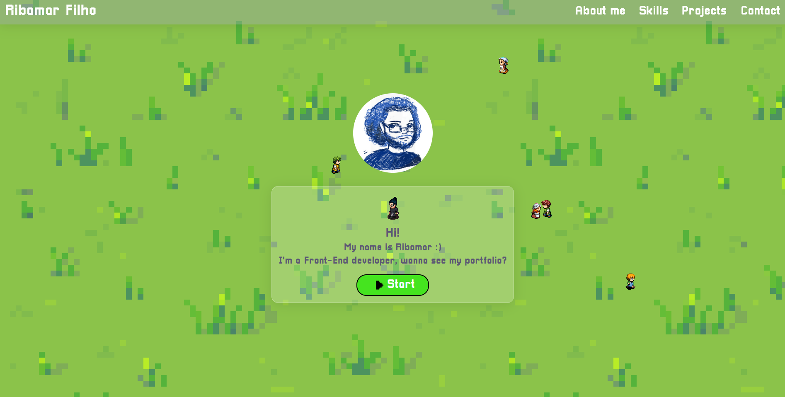

# My portfolio!

## 👀 Project Overview

- 😎 A webpage showing my projects and skills as a dev.
- 👨‍💻 Mainly uses React and Next. TailwindCSS for the styling and responsivity.
- 🔗 You can find this project live on: https://dev-portfolio-ribamarf01.vercel.app (Looking for a domain).

## 🔥 Techs used

<div style="
    display: inline-block
">
    
    
    
    
</div>

## 🔧 Build Setup

```bash
# install dependencies
$ npm install || yarn

# server with hot reload at localhost:3000
$ npm run dev || yarn dev

# build for production
$ npm run build || yarn build

# run the serverside app
$ npm run start || yarn start

```

## 📷 Project images



## 👽 External links

- 🔗 LPC Spritesheet Character Generator: https://sanderfrenken.github.io/Universal-LPC-Spritesheet-Character-Generator/ (The credits can be found at ./github/sheet-credits.csv) 💓
